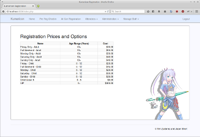

ConReg
======

Convention attendee management software (registration/check in)

Superseded by [KumoReg](http://github.com/jashort/kumoreg/)

- Pre-registration check in and badge printing
- At-con registration and badge printing
- Attendee search for operations
- Reporting (checkins/revenue)
- Configurable pass types and prices. Passes can be hidden temporarily.
- User management (security roles/permissoins) see [docs/PermissionLevels.md](docs/PermissionLevels.md)
- Change history tracking

Developed for [Kumoricon](http://www.kumoricon.org/)

Requirements
============

- Apache 2
- PHP 5
- PEAR
- MySQL 5.1

Installation
============

See [docs/INSTALL.md](docs/INSTALL.md)

Developed By
=============

- Tim Zuidema
- Jason Short
